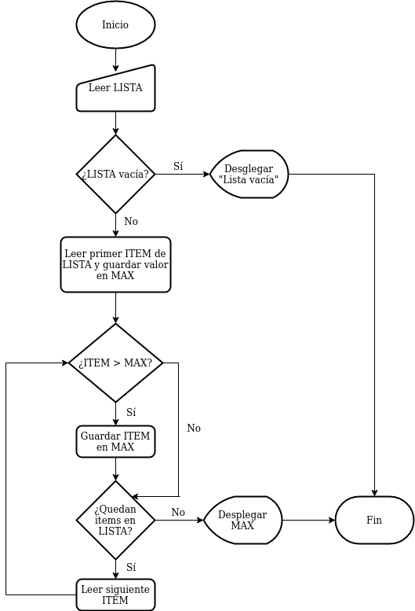
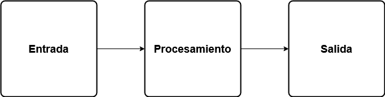
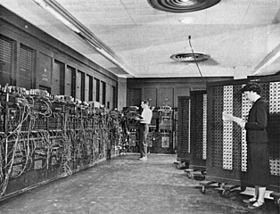
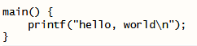

class: title-slide, right, top
background-image: url(img/turing-machine.png)
background-size: contain

.right-column[
# `r rmarkdown::metadata$title`

`r rmarkdown::metadata$author`<br>
`r rmarkdown::metadata$institute`
]

.palegrey[.left[.footnote[<small>Representación artística de una [máquina de Turing](https://es.wikipedia.org/wiki/M%C3%A1quina_de_Turing). Fuente: [Porao](https://commons.wikimedia.org/wiki/File:Turing_Machine.png).</small>]]]

---

# Contenidos

- ### Pensamiento computacional
  - #### Resolución de problemas mediante computadoras
  - #### Principios fundamentales
  - #### Algoritmos

- ### Arquitectura de computadoras
  - #### Historia
  - #### Arquitectura de von Neumann
  - #### Código binario
  - #### Lenguajes de programación
  
---
# Computadora

--
### *"__Máquina electrónica__ que, mediante determinados __programas__, permite almacenar y tratar información, y resolver __problemas de diversa índole__."* ([Diccionario de la lengua española](https://dle.rae.es/computador#A4hIGQC)).

--
### *"__Máquina electrónica digital programable__ que ejecuta una serie de comandos para __procesar__ los datos de __entrada__, obteniendo convenientemente información que posteriormente se envía a las unidades de __salida__."* ([Wikipedia](https://es.wikipedia.org/wiki/Computadora)).

--
### *"A computer is a __machine or device__ that performs processes, calculations and operations based on instructions provided by a software or hardware __program__. It has the ability to accept data (__input__), __process__ it, and then produce __outputs__."* ([Techopedia](https://www.techopedia.com/definition/4607/computer)).

---

# Características de las computadoras

--
### Son **programables**: su funcionamiento puede modificarse sin alterar sus componentes físicos, especificando secuencias de instrucciones (ej. cálculos, operaciones lógicas) que se ejecutan automáticamente.

--
### Estas secuencias de instrucciones son denominadas **programas**.

--
### Los programas trabajan con un modelo de **entrada - procesamiento - salida**:
- #### Reciben datos de **entrada** del usuario o alguna otra fuente.
- #### Los **procesan** mediante cálculos o algún otro tipo de operación.
- #### Como resultado del procesamiento, generan **salidas**.

---

# ¿Por qué utilizamos computadoras?

--
### Pueden ayudar a resolver problemas.

--


--
### La forma de solucionar un problema debe expresarse de forma tal que pueda ser implementada en una computadora.

---
# Ejemplos de problemas que pueden resolverse con ayuda de computadoras (y otras máquinas)

### - Numéricos (ej. [aritméticos](https://es.wikipedia.org/wiki/Stepped_Reckoner))
### - Criptográficos (ej. [descodificación de mensajes](https://es.wikipedia.org/wiki/Bombe))
### - Militares (ej. [cálculo de trayectorias de proyectiles](https://es.wikipedia.org/wiki/ENIAC))
### - Científicos
### - Financieros
### - Empresariales
### - Recreativos

---
# Problemas geoespaciales - ejemplo

--
<figure>
  
</figure>

--
<figcaption>
  <small><a href="https://www.theguardian.com/news/datablog/2013/mar/15/john-snow-cholera-map">Mapa de John Snow</a> que muestra los casos de cólera durante la <a href="https://es.wikipedia.org/wiki/Epidemia_de_c%C3%B3lera_de_Broad_Street">epidemia de Broad Street</a>, Londres, en 1854.  Puede apreciarse la cercanía de muchos casos a la bomba de agua contaminada en la intersección de Broad Street y Cambridge Street. Fuente: <a href="https://en.wikipedia.org/wiki/File:Snow-cholera-map-1.jpg">John Snow</a>.</small>
</figcaption> 

---
# Otros ejemplos de problemas geoespaciales

- ### ¿Cuáles son las zonas prioritarias para la conservación de una especie?
- ### ¿Cuál es la mejor ubicación para un local comercial?
- ### ¿Cuáles son las áreas más vulnerables a desastres naturales?
- ### ¿Cuáles son los lugares en los que una epidemia tiene más probabilidades de impactar?
- ### ¿Cuál es la ruta más corta entre dos sitios?

---

# Pensamiento computacional

--
- ### Es un enfoque para la resolución de problemas basado en conceptos y métodos de las ciencias de la computación.

--
- ### Puede ser aplicado en muchas áreas, no solo en computación.

--
- ### Se considera una de las destrezas fundamentales del siglo XXI.

--
- ### Investigación en pensamiento computacional:
  - #### [Papert, 1996](http://www.papert.org/articles/AnExplorationintheSpaceofMathematicsEducations.html)
  - #### [Wing, 2006](https://www.cs.cmu.edu/~15110-s13/Wing06-ct.pdf)

---

# Conceptos fundamentales del pensamiento computacional

--
- ### **Descomposición**: división de un problema en subproblemas más pequeños.

--
- ### **Reconocimiento de patrones**: búsqueda de similitudes de un problema a resolver, con problemas ya resueltos.

--
- ### **Abstracción**: identificación de la información que se necesita y filtrado de la que no se necesita para resolver un problema.

--
- ### **Algoritmos**: descripción, paso por paso, de la solución a un problema.

---

# Descomposición - ejemplo
## Escritura de un documento

--
.pull-left[
### Documento sin secciones
<figure>
  
  <figcaption>
    <small>Fuente: <a href="https://www.coursera.org/learn/computational-thinking-problem-solving">Universidad de Pennsylvania</a>.</small>
  </figcaption>
</figure>
]

--
.pull-right[
### Documento con secciones
<figure>
  
  <figcaption>
    <small>Fuente: <a href="https://www.coursera.org/learn/computational-thinking-problem-solving">Universidad de Pennsylvania</a>.</small>
  </figcaption>
</figure>
]

---

# Reconocimiento de patrones - ejemplo
## Patrones de diseño de software

--
.pull-left[
- "*Cada patrón describe un problema que ocurre infinidad de veces en nuestro entorno, así como la solución al mismo, de tal modo que podemos utilizar esta solución un millón de veces más adelante sin tener que volver a pensarla otra vez.*" ([Christopher Alexander, 1977](https://laptrinhx.com/a-pattern-language-3372046788/))

- Los patrones de diseño de software alcanzaron gran popularidad con la publicación del libro [*Design Patterns: Elements of Reusable Object-Oriented Software* (1994)](https://en.wikipedia.org/wiki/Design_Patterns), en el cual se documentan [23 patrones de diseño de software](https://en.wikipedia.org/wiki/Design_Patterns#Patterns_by_type).
]

--
.pull-right[
<figure>
  
  <figcaption>
    <small>Diagrama de interacciones en el patrón de diseño de software denominado <a href="https://es.wikipedia.org/wiki/Modelo%E2%80%93vista%E2%80%93controlador">Modelo-Vista-Controlador o <em>Model-View-Controller</em> (MVC)</a>. Fuente: <a href="https://commons.wikimedia.org/wiki/File:MVC-Process.svg">RegisFrey</a>.</small>
  </figcaption>
</figure>
]

---

# Abstracción - ejemplo
## Selección de atributos de un conjunto de datos

--
.pull-left[
### Atributos generales de una persona
- Nombre
- Edad
- Ingreso mensual
- Historial académico
- Pasatiempos
- Color favorito
- Estatura
- Peso
- Historial médico
- ...
]

--
.pull-right[
#### Atributos a considerar para la BD de una universidad
- Nombre
- Edad
- Historial académico
- ...

#### Atributos a considerar para la BD de una red social
- Nombre
- Edad
- Pasatiempos
- ...
]

---

# Algoritmos

--
- ### Indicaciones detalladas de como resolver, paso por paso, un problema.

--
- ### Especifican el orden en el que deben ejecutarse los pasos, así como las condiciones que deben cumplirse antes de cada paso.

---

# Algoritmos - ejemplo
## Receta de cocina - [Arroz con pollo](https://www.recetascostarica.com/recetas/plato-principal/arroz-con-pollo-costarricense)

--
<figure>
  
  <figcaption>
    <small>Fuente: <a href="https://cookpad.com/cr/recetas/6014919-arroz-con-pollo-al-estilo-costarricense">Cookpad</a>.</small>
  </figcaption>
</figure>

---

# Algoritmos - ejemplo
## Obtener el valor máximo de una lista

--
#### lista = [29.6, -36.81, 31.85, 25.71, 90.2, 0.4]

--
Solo es posible comparar dos elementos de la lista a la vez, para determinar si uno es mayor, menor o igual que otro.

--
#### Algoritmo

--
1. Se lee la lista (del teclado, de un archivo o de alguna otra fuente).

--
2. Si la lista está vacía, se despliega la hilera de texto "Lista vacía" y se concluye el proceso. Si no, se continúa con el paso 3.

--
3. Se designa el primer elemento de la lista como "máximo actual".

--
4. Se recorre la lista y se compara cada uno de los elementos con el máximo actual.

--
5. Si un elemento comparado es mayor que el máximo actual, entonces pasa a ser el nuevo máximo actual.

--
4. El valor máximo de la lista es el máximo actual, cuando termina de recorrerse la lista.

---

# Algoritmos - ejemplo
## Obtener el valor máximo de una lista (continuación)

--
### Ejecución del algoritmo

--
<span style="color:green";>elemento en verde = máximo actual</span>  
<span style="color:red";>elemento en rojo  = elemento que está siendo comparado</span>
<p>

--
[<span style="color:green;">29.6</span>, <span style="color:red;">-36.81</span>, 31.85, 25.71, 90.2, 0.4]  
<p>

--
[<span style="color:green;">29.6</span>, -36.81, <span style="color:red;">31.85</span>, 25.71, 90.2, 0.4]  
<p>

--
[29.6, -36.81, <span style="color:green;">31.85</span>, <span style="color:red;">25.71</span>, 90.2, 0.4]  
<p>

--
[29.6, -36.81, <span style="color:green;">31.85</span>, 25.71, <span style="color:red;">90.2</span>, 0.4]  
<p>

--
[29.6, -36.81, 31.85, 25.71, <span style="color:green;">90.2</span>, <span style="color:red;">0.4</span>]  
<p>

--
[29.6, -36.81, 31.85, 25.71, <span style="color:green;">90.2</span>, 0.4]  
<p>

--
### Valor máximo = <span style="color:green;">90.2</span>

---

# Algoritmos - diagramas de flujo

--
.pull-left[
- ### Los [diagramas de flujo](https://es.wikipedia.org/wiki/Diagrama_de_flujo) son representaciones diagramáticas de un algoritmo.
- ### Representan los pasos del algoritmo mediante [símbolos](https://es.wikipedia.org/wiki/Diagrama_de_flujo#Simbolog%C3%ADa_y_significado) y su orden de ejecución mediante flechas.
- ### Por convención, se leen de arriba hacia abajo o de izquierda a derecha.
]

--
.pull-right[
#### Ejemplo: obtener el máximo de una lista
<figure>
  
</figure>
]

---

# Algoritmos - pseudocódigo

--
.pull-left[
- ### El [pseudocódigo](https://es.wikipedia.org/wiki/Pseudoc%C3%B3digo) es una descripción textual y en lenguaje natural de un algoritmo.
- ### Su estructura se asemeja a la de un lenguaje de programación, pero está diseñado para que ser comprendido por personas, no para ser ejecutado por computadoras.
]

--
.pull-right[
#### Ejemplo: obtener el máximo de una lista
```r
LISTA <- Leer()
si (Vacia(LISTA)) {
  Desplegar("Lista vacía")
} si no {
  MAX <- LISTA[1]
  I <- 1
  mientras (I <= Longitud(LISTA)) {
    ITEM <- LISTA[I]
    si (ITEM > MAX) {
      MAX <- ITEM
    }
    I <- I + 1
  }
  Desplegar(MAX)
}
```
]

---

# Algoritmos - implementación en [R](https://www.r-project.org/)

```r
# Obtener el valor máximo de una lista

lista <- c(29.6, -36.81, 31.85, 25.71, 90.2, 0.4)
cat("Lista de entrada: ", lista, "\n")

if (length(lista) == 0) {
  cat("La lista está vacía", "\n")
} else {
  max <- lista[1]
  i <- 1
  while (i <= length(lista)) {
    if (lista[i] > max) {
      max <- lista[i]
    }
    i <- i + 1
  }
  
  cat("Valor máximo de la lista: ", max, "\n")
}
```

---

# Algoritmos - implementación en [Python](https://www.python.org/)

```python
# Obtener el valor máximo de una lista

lista = [29.6, -36.81, 31.85, 25.71, 90.2, 0.4]
print("Lista de entrada: ", lista)

if (len(lista) == 0):
    print("La lista está vacía")
else:
    max = lista[0]
    i = 0
    while (i < len(lista)):
        if (lista[i] > max):
            max = lista[i]
        i = i + 1
        
    print("Valor máximo de la lista:", max)  
```

---

# Entrada -> Procesamiento -> Salida

--
Este patrón describe el flujo de trabajo básico de cualquier algoritmo o programa.

<br><br>
<figure>
  
</figure>

---

# Computadoras digitales binarias

.pull-left[
- Las computadoras modernas están construídas con base en [circuitos integrados (CI)](https://es.wikipedia.org/wiki/Circuito_integrado), también llamados *chips* o *microchips*.

- Los CI procesan [información digital](https://es.wikipedia.org/wiki/Se%C3%B1al_digital) (que usa valores discretos), la cual generalmente es binaria (i.e. de dos valores).

- Los CI de una computadora procesan dos estados correspondientes a **dos niveles de tensión eléctrica: alto y bajo**. Estos estados se representan con **0 y 1**. Esto facilita la aplicación de la [lógica binaria](https://es.wikipedia.org/wiki/L%C3%B3gica_binaria) y de la [aritmética binaria](https://es.wikipedia.org/wiki/Sistema_binario).
]

.pull-right[
<figure>
  
  <figcaption>
    <small>
      Imagen de <a href="https://unsplash.com/@slavudin?utm_source=unsplash&utm_medium=referral&utm_content=creditCopyText">Slejven Djurakovic</a> disponible en <a href="https://unsplash.com/s/photos/chip?utm_source=unsplash&utm_medium=referral&utm_content=creditCopyText">Unsplash</a>.
    </small>
  </figcaption>
</figure>

<figure>
  
  <figcaption>
    <small>
      Imagen de <a href="https://unsplash.com/@yasin?utm_source=unsplash&utm_medium=referral&utm_content=creditCopyText">Yasin Hasan</a> disponible en <a href="https://unsplash.com/s/photos/alarm-clock-digital?utm_source=unsplash&utm_medium=referral&utm_content=creditCopyText">Unsplash</a>.
    </small>
  </figcaption>
</figure>
]

---

# Historia de la computadora

--
### Durante el siglo XVII, varios matemáticos construyeron [calculadoras mecánicas](https://es.wikipedia.org/wiki/Pascalina) capaces de sumar, restar, multiplicar y dividir.

--
### En la primera mitad del siglo XIX, **Charles Babbage** diseñó la [máquina analítica](https://es.wikipedia.org/wiki/M%C3%A1quina_anal%C3%ADtica), considerada la primera computadora programable.

--
### A mediados del siglo XIX, **George Boole** introdujo el [álgebra booleana](https://es.wikipedia.org/wiki/%C3%81lgebra_de_Boole), la cual trata sobre las operaciones (ej. AND, OR, NOT) en valores lógicos (Verdadero o Falso).

--
### En la primera mitad del XX, **Claude Shannon** demostró como el álgebra booleana podía ser aplicada al diseño de [circuitos digitales](https://es.wikipedia.org/wiki/Circuito_digital).

---

# La máquina de Turing

--
- ### Durante el período entre las guerras mundiales, **Allan Turing** desarrolló la [máquina de Turing](https://es.wikipedia.org/wiki/M%C3%A1quina_de_Turing), un dispositivo teórico que manipula símbolos de una cinta de acuerdo con una tabla de reglas.

--
- ### La máquina de Turing simula el funcionamiento de un algoritmo y los conceptos de **entrada, procesamiento y salida**.

--
- ### La mayoría de las computadoras modernas están basadas en el concepto de la máquina de Turing.

---

# Representación artística de la máquina de Turing

--
<figure>
  
  <figcaption>
    <small>
      Representación artística de una máquina de Turing. Imagen de <a href="https://commons.wikimedia.org/wiki/File:Turing_Machine.png">Porao en Wikimedia</a>.
    </small>
  </figcaption>
</figure>

---

# Primeras computadoras electrónicas

--
- ### Con base en las ideas de Turing, las computadoras [Bombe](https://es.wikipedia.org/wiki/Bombe) y  [Colossus](https://es.wikipedia.org/wiki/Colossus) fueron construídas durante la II Guerra Mundial (1939 - 1945) en el Reino Unido para descifrar mensajes codificados. A pesar de que se consideran de las primeras computadoras digitales electrónicas programables, su programación se realizaba a través de componentes de *hardware*, como interruptores y enchufes, y no con un [programa almacenado](https://es.wikipedia.org/wiki/Computador_de_programa_almacenado).

--
- ### También durante la II Guerra Mundial, el ejército de Estados Unidos de América construyó [ENIAC (Electronic Numerical Integrator and Computer)](https://es.wikipedia.org/wiki/ENIAC) para calcular tablas de tiro de artillería. Es considerada por algunos como la primera computadora programable digital de propósito general. Era capaz de seguir el modelo de la máquina de Turing, por lo que era [Turing-completa](https://es.wikipedia.org/wiki/Turing_completo). 

---

# Primeras computadoras electrónicas

.pull-left[
<figure>
  
  <figcaption>
    <small>
      Computador Colossus operado por integrantes del <em>Women's Royal Naval Service (WRNS)</em>. Imagen de <a href="https://commons.wikimedia.org/wiki/File:Colossus.jpg">autor desconocido en Wikimedia</a>.
    </small>
  </figcaption>
</figure>
]

.pull-righ[
<figure>
  
  <figcaption>
    <small>
      ENIAC programado por Glen Beck y Betty Snyder. Imagen del <a href="https://commons.wikimedia.org/wiki/File:Eniac.jpg">Ejército de Estados Unidos en Wikimedia</a>.
    </small>
  </figcaption>
</figure>
]

---

# La arquitectura de von Neumann

--
- ### En 1945, **John von Neumann** propuso un concepto conocido como **programa almacenado**, en el cual los datos y los programas se almacenan en una estructura llamada **memoria**, separada del hardware que ejecuta las instrucciones.

--
- ### Este modelo permite que las computadoras sean más fáciles de reprogramar y es conocido actualmente como [arquitectura de von Neumann](https://es.wikipedia.org/wiki/Arquitectura_de_Von_Neumann).

---

# Diagrama de la arquitectura de von Neumann

--
<figure>
  
  <figcaption>
    <small>
      Diagrama de la arquitectura de von Neumann. Imagen de <a href="https://commons.wikimedia.org/wiki/File:Arquitecturaneumann.jpg">David Strigoi en Wikimedia</a>.
    </small>
  </figcaption>
</figure>

---

# Componentes de la arquitectura de von Neumann
## Memoria principal

--
- ### Almacena las instrucciones de los programas y los datos que utilizan estos programas.

--
- ### Es común denominarla como RAM (*Random Access Memory*, Memoria de Acceso Aleatorio), lo que significa que toma el mismo tiempo acceder a cualquier posición de la memoria.

--
- ### Cada posición de memoria tiene una dirección a la que se hace referencia cuando se desea leer o escribir.

---

# Componentes de la arquitectura de von Neumann
## Unidad central de procesamiento

--
- ### La Unidad Central de Procesamiento o CPU (*Central Processing Unit*) se encarga de ejecutar las instrucciones de los programas.

--
- ### Está compuesta por dos partes:
  - #### La Unidad de Control: determina cuál es la siguiente instrucción a ejecutar. Contiene memorias temporales de alta velocidad y poca capacidad llamadas registros, para almacenar los operandos y el resultado de las instrucciones.
  - #### La Unidad de Aritmética y Lógica o ALU (*Arithmetic and Logic Unit*): ejecuta las operaciones aritméticas y lógicas.
  
---

# Componentes de la arquitectura de von Neumann
## Sistemas de entrada y salida

--
- ### Permiten que la computadora interactúe con el usuario y, en general, con el mundo exterior.

--
- ### Algunos ejemplos son el teclado y el ratón, como sistemas de entrada, y la pantalla y la impresora, como sistemas de salida.

---

# Código binario

--
- ### Los CI de las computadoras usan voltajes bajos y altos para representar dos posibles valores de información: 0 y 1. Este es un sistema binario y cada dígito binario (0 o 1) se denomina *bit* (*binary digit*).

--
- ### Los bits se agrupan (por ejemplo, en [bytes = 8 bits](https://es.wikipedia.org/wiki/Byte)) para representar elementos de información más complejos, como números más grandes o carácteres de texto. Por ejemplo:
  - El número decimal ```14``` se representa en binario como ```1110```:  
```1110``` = ```2^3*1 + 2^2*1 + 2^1*1 + 2^0*0``` = ```8 + 4 + 2 + 0``` = ```14```
  - La palabra ```bit``` se representa en [código ASCII](https://es.wikipedia.org/wiki/ASCII) como:  
```01100010 01101001 01110100``` = ```bit```

---

# Lenguaje máquina

--
- ### El [lenguaje máquina](https://es.wikipedia.org/wiki/Lenguaje_de_m%C3%A1quina) es un conjunto de instrucciones binarias interpretables por un CPU. Las instrucciones representan acciones a ser ejecutadas por la computadora. Cada CPU tiene su propio lenguaje máquina. 

--
- ### Un programa consiste de una secuencia de instrucciones en lenguaje máquina.

--
- ### Por ejemplo, la siguiente instrucción suma los contenidos de los registros 1 y 2 y almacena el resultado en el registro 6 de un CPU:

<figure>
  
  <figcaption>
    <small>
      Instrucción de suma en lenguaje máquina. Fuente <a href="https://en.wikipedia.org/wiki/Machine_code">Machine code - Wikipedia</a>.
    </small>
  </figcaption>
</figure>

---

# Lenguajes de programación

--
- ### Debido a que programar una computadora en lenguaje máquina es excesivamente lento y complicado, en la década de 1950 comenzaron a crearse lenguajes de programación que, en lugar de unos y ceros, consisten de instrucciones formadas por palabras, usualmente en idioma inglés. Por ejemplo, el siguiente programa en lenguaje [C](https://www.iso.org/standard/74528.html) imprime la hilera de texto ["hello, world\n"](http://helloworldcollection.de/):

<figure>
  
</figure>

--
- ### Existe una gran [variedad de lenguajes de programación](https://en.wikipedia.org/wiki/List_of_programming_languages) que han sido creados con diversos fines: científicos, comerciales, educacionales, etc.